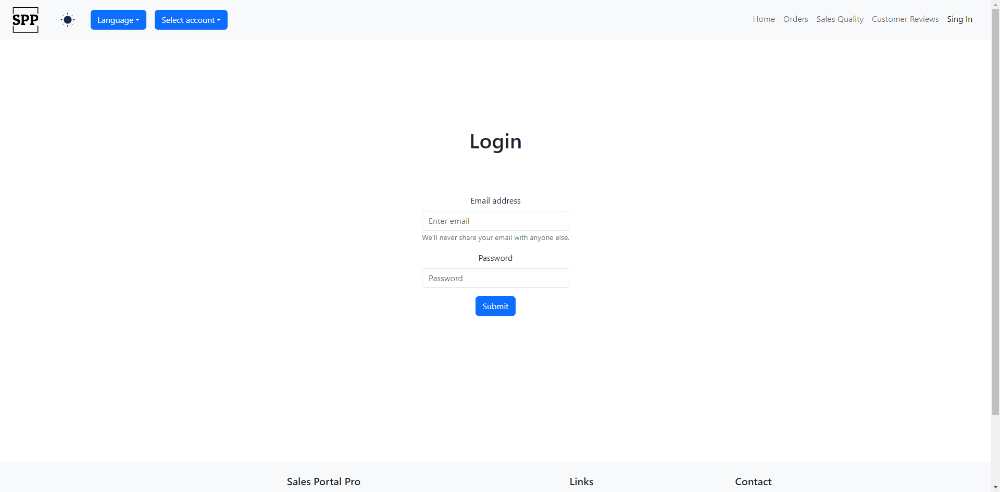
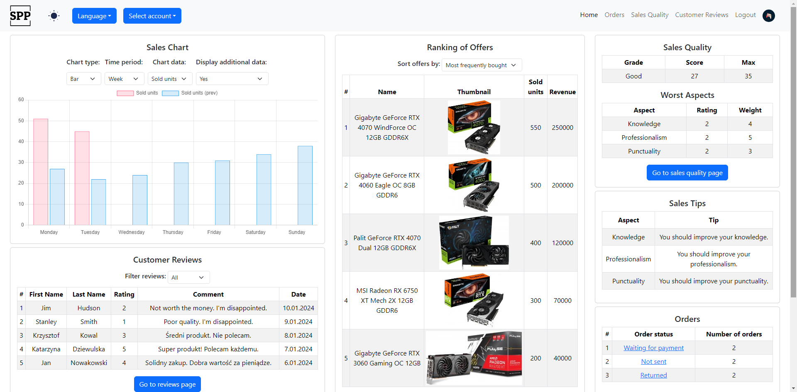
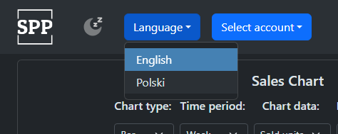
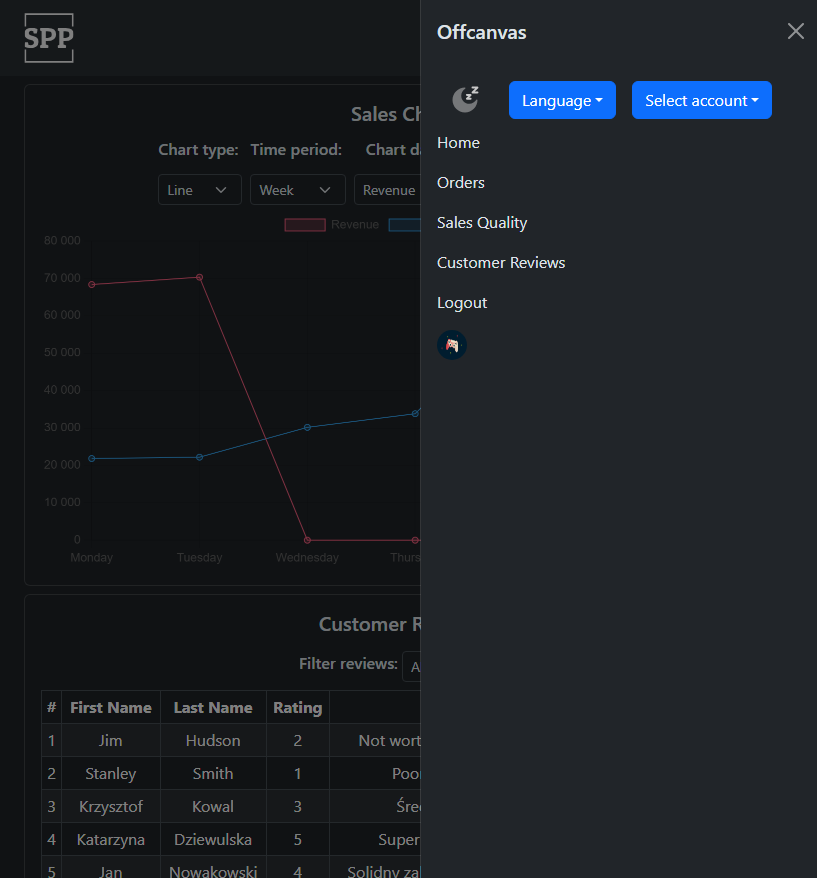
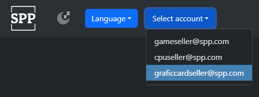
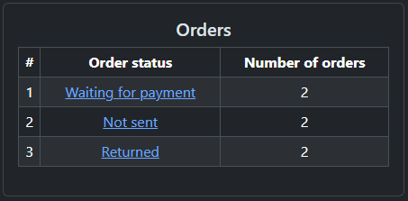
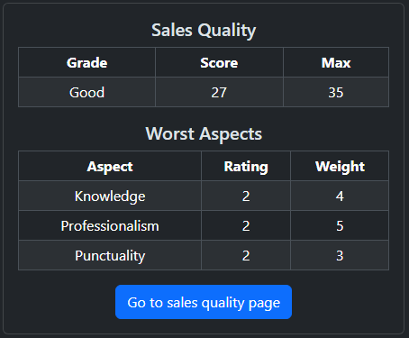
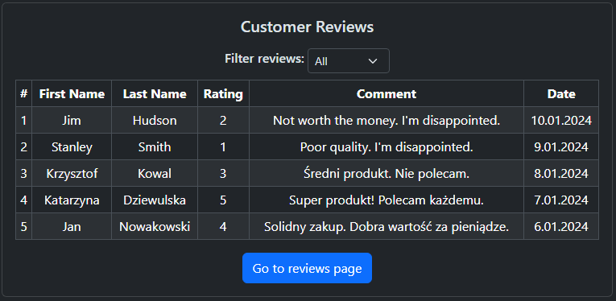
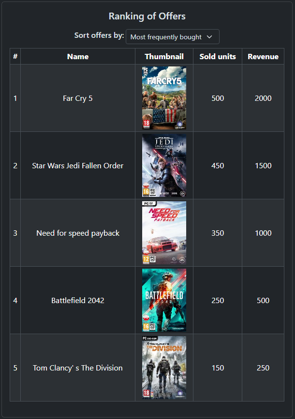
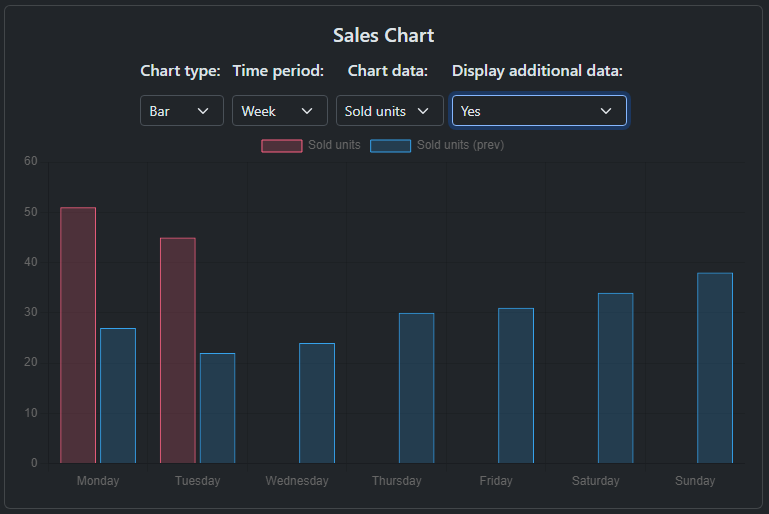

# SellersDashboard
React Sellers Dashboard App Repository: This repository hosts a React-based application designed for sellers.

## Description
The main goal of this project is to create a "Seller Panel" - a page within a shopping portal where users can view a summary of their sales.

## How to Run
Change directory to *frontend* and start with `npm start`.

## How to log in
The application has 3 mock users:
- `gameseller@spp.com` with password `123456`
- `cpuseller@spp.com` with password `123456`
- `graficcardseller@spp.com` with password `123456`

## Features of the Portal

1. **Login Process**
    - To access the "Seller Panel," the user must log in.
    - The login process can be simplified, for example, by entering the user identifier.
    - 
2. **Seller Panel Widgets**
    - The "Seller Panel" includes the following widgets:
        - "Orders"
        - "Sales Quality"
        - "Buyer Reviews"
        - "Offer Rankings"
        - "Sales Chart"
        - "Selling Tips"
    - 

3. **Multilingual Support**
   - The portal should be available in two languages:
      - Polish
      - English

4. **Color Scheme Customization**
   - The portal should allow users to change the color scheme:
      - Dark mode
      - Light mode
   - 

5. **Responsive Design**
   - The portal should be responsive and work on most mobile devices.
   - 

6. **Multitenancy Support**
    - Each seller can have multiple accounts (e.g., to distinguish product assortments), all linked together.
    - After logging into one of the linked accounts, the user can browse data for any of those accounts.
    - 

7. **Orders Widget**
    - Displays the number of orders categorized as:
        - Unpaid
        - Not Shipped
        - Returns
    - Clicking on a category redirects the user to the "Orders" page.
    - If the user has no orders, a message encourages them to use services that increase offer visibility (promotion, etc.).
    - 

8. **Sales Quality Widget**
    - Sellers are rated in various "aspects."
    - Each "aspect" has a specific maximum point value (weight), which may vary.
    - The total points awarded to the seller in different "aspects" determine the "quality rating."
    - The widget should show:
        - "Quality rating" with the maximum achievable score
        - "Quality category"
        - 3 "aspects" in which the seller scored the lowest.
    - Users can navigate to the "Sales Quality" page.
    - 

9. **Buyer Reviews Widget**
    - Presents the five latest buyer reviews (rating + optional comment).
    - Users can filter reviews into three categories:
        - All
        - Positive
        - Negative
    - Users can go to the "Buyer Reviews" page.
    - Displays a message if there are no reviews.
    - 

10. **Offer Rankings Widget**
    - Displays the top 5 offers sorted by user-selected criteria:
        - Most frequently purchased - descending by the number of units sold, then descending by turnover
        - Least frequently purchased - ascending by the number of units sold, then descending by the number of views
    - Features presented regardless of the sorting criteria:
        - Name
        - Thumbnail of the main image
    - Additional features for "most frequently purchased":
        - Number of units sold
        - Turnover
    - Additional features for "least frequently purchased":
        - Number of units sold
        - Number of unique views
    - Displays a message if there are no offers.
    - 

11. **Sales Chart Widget**
    - Users can choose one of two metrics presented on the chart:
        - Turnover
        - Number of units sold
    - Users can select a time range:
        - Today - time axis divided into hours
        - Current week - time axis divided into days
        - Previous week - time axis divided into months
    - Users can choose the presentation style:
        - Bar chart
        - Line chart
    - Users can enable an additional data series representing data from the previous period.
    - The point on the chart representing data from an ongoing period should be highlighted.
    - 

